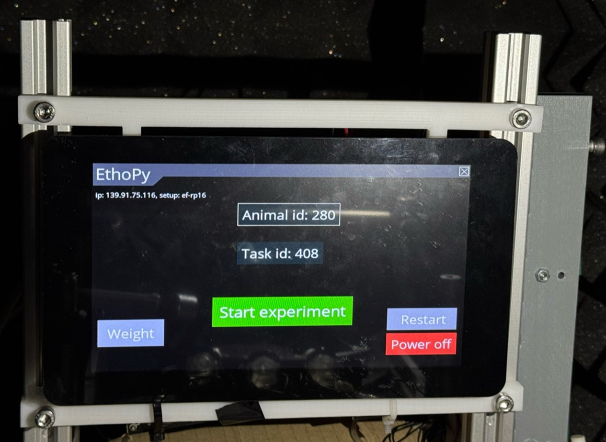
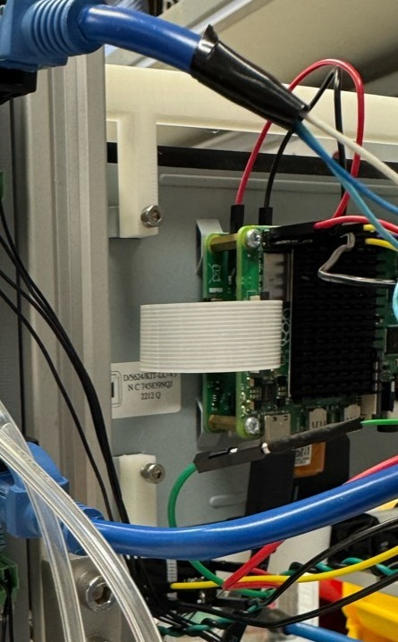
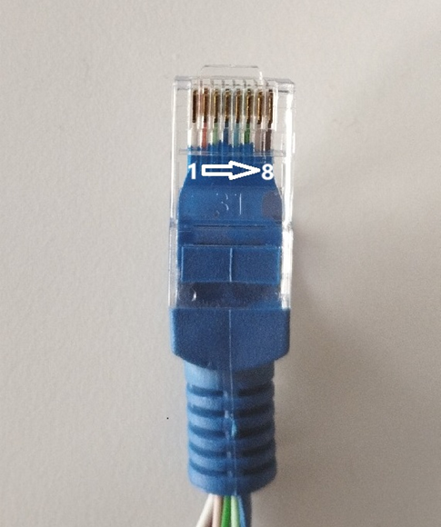

# Air-track setup

In this paradigm, head-fixed mice perform a visual two-alternative forced choice task. This setup can be adapted to accommodate more sensory modalities by using appropriate equipment.

## Hardware parts list

### Electronics

| # |Item                                                         |Qty  |Source                 |Identifier   |Notes                          |
|:-:|:-:                                                          |:-:  |:-:                    |:-:          |:-:                            |

|1  |Bpod port interface board                                    |3    |Sanworks               |1008         |Controlling the behavior ports |

|2  |solenoid valves                                              |2    |LEE                    |LHDA0533415H |                               |

|3  |Infrared Emitter 880nm Circular Right Angle 2-Pin Side Looker|3    |Honeywell              |SEP8736-002  |For the behavior ports         |

|4  |Phototransistor IR Chip Silicon 880nm 2-Pin Side Looker      |3    |Honeywell              |SDP8436-002  |For the behavior ports         |

|5  |Ethernet cable                                               |3    |Bel                    |BC-5UK005F   |                               |

|6  |Cable 0.05 mm², Ø 0.8mm                                      |1    |TRU_                   |1567774      |                               |

### Other Hardware

| # |Item                                                           |Qty                                  |Source                 |Identifier   |Notes                          |
|:-:|:-:                                                            |:-:                                  |:-:                    |:-:          |:-:                            |

|1  |Plexiglas air-table                                            |1                                    |Provided by Mostafa A. Nashaat, Larkum Lab, Larkum Lab, Charite, Berlin|             |

|2  |PLA platform                                                   |1                                    |Provided by Mostafa A. Nashaat, Larkum Lab, Charite, Berlin          |             |

|3  |Behavior port                                                  |3                                    |                       |             |                               |

|4  |Crimp For Dupont Female                                        |15                                   |Ninigi                 |NDR-T        |                               |

|5  |Tygon S3™ E-3603 Tubing (water) Ø Inner 2.38mm, Ø outer 3.97mm |4 pieces                             |Optubus                |TY2,38ST3,97 |                               |

|6  |Tygon S3™ E-3603 Tubing (water) Ø Inner 0.79mm, Ø outer 2.38mm |2 pieces                             |Optubus                |TY0,79ST2,38 |                               |

|7  |V-Hive Enclosure Base Model                                    |1                                    |RatRig                 |HW3303GK      |                               |

|8  |Sound insulator ISOLFON foam plate                             |4 pieces 50x50cm and 2 pieces 50x43cm|Mega Acoustic          |244317 (PA-PMP5-DG-5050)      |for sound and light insulation |

|9  |Heat shrink set                                                |                                     |GROBOTRONICS           |05-00017098  |                               |

### 3D printed parts
| # |Item                                                           |Qty  |Filename             |
|:-:|:-:                                                            |:-:  |:-:                  |

|1  |screen holders                                                 |2    |screen_holder_v4.stl |

## Step-by-step assembly instructions

You will find the blueprints for the items you should 3D print [here](3d_designs).

> :bulb: **Info:** The  air-table ([see Other Hardware, part #1](#hardware1)) and platform ([see Other Hardware, part #2](#hardware2)) of the air-track were developed by Dr. Mostafa A. Nashat and assembly ([paper](https://doi.org/10.1152/jn.00088.2016), [instructions](https://doi.org/10.1101/2024.08.22.608577)).

**Step 1**. Set up the Raspberry Pi Behavioral Setup following steps 1-7, modifying Raspberry Pi Behavioral Setup Step 5 to connect only the valves ([see Electronics, part #2](#electro2)) to the EthoPy Controller Board.

**Step 2**: Mount the Raspberry Pi Behavioral Setup on the screen holders ([see 3D printed parts, part #1](#printed1)) in front of the air-table ([Fig. 1](#fig1)).

<figure id="fig1">
  
  
  <figcaption><b>Figure 1</b>: <i>The RP behavioral setup, mounted on the aluminum rails of the air-table using the screen holders.</i></figcaption>
</figure>

**Step 3**: Assembling of a behavior port ([see Other Hardware, part #3](#hardware3)). Mounting of the infrared emitter ([see Electronics, part #3](#electro3)) and phototransistor ([see Electronics, part #4](#electro4)) to the port was performed following the instructions provided here. Each platform included three behavior ports.

> :memo: **Note:**  For our experiments, we did not include LED light in the behavior ports.

**Step 4**: Set up three Bpod port interface boards ([see Electronics, part #1](#electro1)) as per instructions provided here. Place the Bpod port Interface Boards close to the Air-track and the Raspberry Pi Behavioral Setup for convenience.

**Step  5**: For each port, connect the infrared emitter and phototransistor with the Bpod port interface board.

> :memo: **Note:**  To reduce the tension caused to the platform from these connections, prefer using wires with a cross-section of 0.05 mm² and an outer diameter of 0.8 mm ([see Electronics, part #6](#electro6)).

**Step 6**: Connecting the Bpod port interface boards to the Raspberry Pi Behavioral Setup. As the connections with the Bpod port interface board are through an Ethernet cable, you will need 3 Ethernet cables, one per port ([see Electronics, part #5](#electro5)).

**Step 7**: Remove the insulation from the edge of the Ethernet wires. Place 13 female terminals ([see Other Hardware, part #4](#hardware4)) at the end of each wire and cover the exposed terminal with insulation (e.g., heat shrink tube, [see Other Hardware, part #9](#hardware9)). In the following steps, the identification of the Ethernet cable wires is shown in ([Fig. 2](#fig2)).

<figure id="fig2">
  
  <figcaption><b>Figure 2</b>: <i>Ethernet cable wire number ids.</i></figcaption>
</figure>

> :memo: **Note:** You will use the wires 1 (signal of the sensor), 4 (power of the emitter), 5 (ground).

**Step 8**:  The wires from the Ethernet cables are connected to the Raspberry Pi Behavioral Setup (see GPIO connections as set in EthoPy github repository) as follows:

- Connect wire 1 (signal) of each Ethernet cable to the respective GPIO pin for the proximity input of each port.
- Connect wire 4 (power) of each Ethernet cable to a 5V power pin.
- Connect wire 5 (ground) of each Ethernet cable to a ground pin.

> :memo: **Note:**  Power cables and grounds should be short-circuited together to connect to one pin of the Raspberry Pi.

**Step 9**: Driving of the valves for ports 1 and 2 using the EthoPy Controller Board ([see Electronics, part #2](#electro2)).

**Step 10**: Adjust the reward tubes ([see Other Hardware, part #5](#hardware5), [part #6](#hardware6)) to the behavioral port and connect the valves. Bridge the valves and connect to the water supply ([Fig. 3](#fig3)).

<figure id="fig3">
  
  <figcaption><b>Figure 3</b>: <i>Solenoid valve with the positions of the tubes</i></figcaption>
</figure>

**Step 11**: If sound/light insulation is needed, the Air-track behavioral system can be enclosed in the Rat-Rig V-Hive Enclosure Base Model ([see Other Hardware, part #7](#hardware7)). Assembly instructions can be found here. For further sound and light insulation, related insulation material ([see Other Hardware, part #8](#

