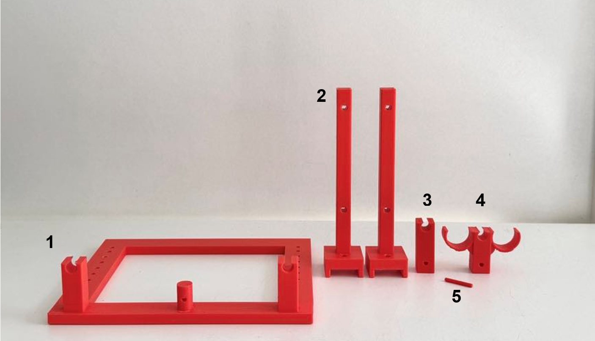
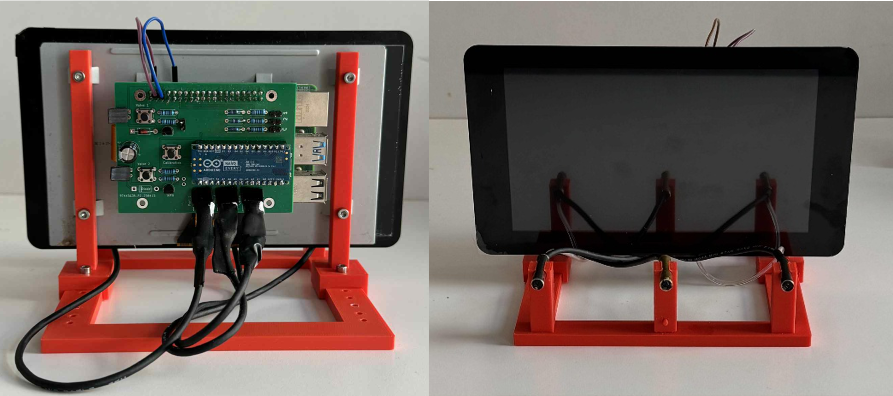
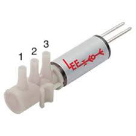

# Raspberry Pi Behavioral Setup
A key component of multiple Ethopy behavioral systems is the [Raspberry Pi](https://www.raspberrypi.com/), a small, affordable, single-board computer. It includes ports for HDMI, USB, Ethernet, audio, camera interface (CSI), display interface (DSI), and General Purpose Input/Output (GPIO) pins. It primarily runs on a Linux-based OS called Raspberry Pi OS, and also supports other operating systems. Below, we analytically describe the steps to implement a Raspberry Pi-based behavioral setup.

## Hardware parts list

### Electronics

### Other Hardware

### 3D printed parts
You will find the blueprints for the items you should 3D print here.

<figure id="fig1">
  
  
  <figcaption><b>Figure 1</b>: <i>RP setup (top: 3D printed parts of the RP’s base, bottom: assembled RP base).</i></figcaption>
</figure>

## Step-by-step assemply instructions

**Step 1.** Install the [operating system of the RPi](https://www.raspberrypi.com/documentation/computers/getting-started.html#installing-the-operating-system). In our experiments, we have used the [Bullseye Raspberry Pi OS](https://www.raspberrypi.com/news/raspberry-pi-os-debian-bullseye/).

**Step 2.** Mount the Raspberry Pi to the Raspberry Pi Touch Display and connect the Flat Flexible Cable and the power of the Touch Display to the Raspberry Pi [instructions](https://www.raspberrypi.com/documentation/accessories/display.html).

**Step 3.** Connect the Ethopy Controller Board to the RPi.

**Step 4.** Add a heatsink (Other Hardware parts list, item #2) on the back of the RP to avoid excessive warming.

**Step 5.** Plug in the side and the center (lick or interruptor) ports, and the valves to the EthoPy Controller Board, to the positions indicated on the board.

**Step 6.** Connect the valves to the water supply. Each LEE valve (Electronics parts list, item #7) has 3 pipe-edges (1) to be connected to the lick port tube, (2) to be connected with the water supply tube, and (3) to be connected with the other valve through a tube and 2 pins to be connected to the board ([Fig. 2, left](#fig1)).

In the RP setup, the upper valve corresponds to the left lick port, and the bottom valve corresponds to the right lick port ([Fig. 2, right](#fig1)).

<figure id="fig2">
  
  
  <figcaption><b>Figure 2</b>: <i>Connections of the solenoid valve (left: positions of the tubes, right: placement of the valves on the RP board).</i></figcaption>
</figure>

**Step 7.** Connect to the RPi and run a test task.

- ssh username@ip_address 

> For more information, visit their: [Rasberry Pi: Remote access](https://www.raspberrypi.com/documentation/computers/remote-access.html)

- Follow the instructions on how to [install/run EthoPy](https://ef-lab.github.io/ethopy_package/installation/)

> :memo: **Note (Optional):** Rename the RP and set a static IP address.

> :bulb: **Tip:** When using multiple RPs, it is best to use unique names that follow a consistent structure and assign static IP addresses to each RP to facilitate identification and management. To do this, connect to the RP and change its default name following the [instructions](https://ef-lab.github.io/ethopy_package/raspberry_pi). It is recommended to use a fixed prefix followed by an incremental number for each RP added.
