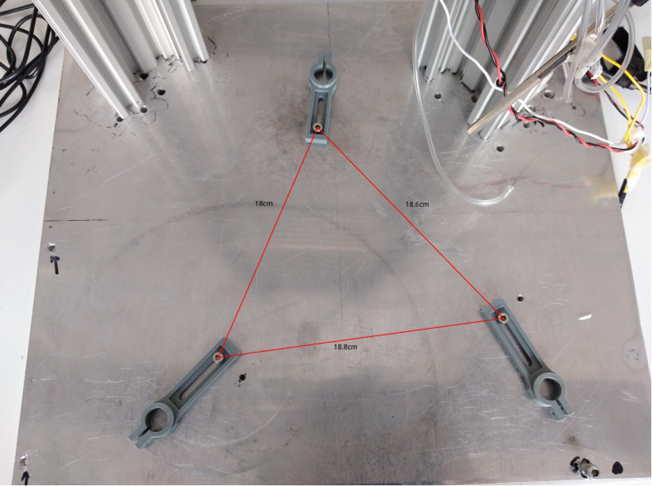
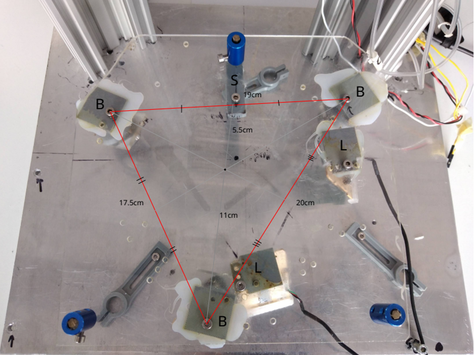
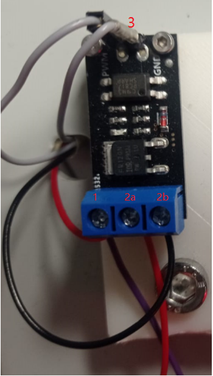

# Step-by-step Assembly Instructions

## Mounting onto the Metallic Plate

1. Create Mounting Holes: Create 3 holes onto the metallic plate, creating a triangle with approximate sides of 18.8 x 18.6 x 18 cm.

2. Mount Aluminum Rails: Screw with 2 or 3 M5 screws each aluminum rail (the 2 with dimensions 50x8x4cm) on the metallic plate, with an angle x° and distance x cm between the two closer edges and x cm between the farther edges.

3. Install 3D-Printed Rod Holders: Use the 3 holes from step 1 to screw an M3 screw and the 3D-printed part 3.6. On each cylindrical part of the rod holders, put the part 2.11 and make sure that they are tightly connected.

4. Insert Metallic Rods: Insert 3 metallic rods with the female side looking up, and screw them with an M3 screw onto the Plexiglass. The screws must create a triangle with sides ...x...x... cm.

## Mounting onto the Plexiglass

1. Create Mounting Holes: You will need to create 6 holes so 3 can be used to mount the 3D-printed ball bearing (**B**) holders, 2 for the laser (**L**) mice holders and 1 for the ball stop (**S**). The size of the holes should fit M4 (16) screws.

2. Mount Ball Bearings: First mount the ball bearings with their base looking inwards. They should create a triangular shape with sides 19 x 17.5 x 20 cm. Then screw the small plexiglass pieces together with the ball bearings on the inclined base of each holder. Make sure that they are looking towards the center of the imaginary triangle and the most anterior bearing is 11 cm from the center, while the posterior have 5.5 cm distance from the center. These values are optimal for a ball with a diameter of 25 cm.

3. Mount Laser Mice Holders: Then mount the laser mice holders looking towards the center of the triangle, with exactly 90° degrees from each other. It's important to mount them as close as possible to the ball bearings. Insert the board of each laser mouse depending on how they are programmed to calculate the virtual position of the subject and ensure they have 2 to 3 mm distance from the surface of the ball. 

**Note:** You will need to remove by unsoldering some parts of the laser mice so they can fit in their holder.

4. Install Ball Stop: Lastly screw the 3D-printed ball stop to secure the ball from slipping out of the ball bearings.

## Mounting on the Metallic Rails

1. Place Odourants Holders: First place the 2 odourants holders on each wide side of the perpendicular aluminum rails. 

**Note:** You may want to do this step before screwing the corner connectors to mount the horizontal rails.

2. Insert Syringe and Sensor Holders: Insert the syringe and the sensor holders at the highest end of one of the aluminum rails.

3. Prepare Hexagon Rods: Cut diagonally the edges of 2 hexagon rods to make space for the mouse to enter, then cut one M3 hole so the headpost can be screwed into place.

4. Connect Hexagon Rod: Screw the male part of the hexagon rod to the female of the small aluminum rail.

5. Assemble with Corner Connectors: Proceed to use the 4 corner connectors to insert perpendicular the two previous parts, and ensure that the 2 holes are aligned and with a distance of 25 cm from their center.

6. Insert Additional Components: On one preferred horizontal rail, insert 3D-printed part 2.10 with the hexagon rod (D: x cm).

## Electrical Connections

1. Pulse Generators: To connect the pulse generators to the set-up we need to consider two things:
- **Power and Ground Connection:** Connect the power and ground of the valve to the board, placing the power at position 2a and the ground at position 2b.
- **Raspberry Pi Connection:** Select the pin of the RP we have programmed to trigger the pulse generator and a ground pin and connect the other end to the PWR and GND pins respectively placed at the top part of the board (position 3).
- **Power Supply:** To turn on the board we need to twist 2 cables and insert them at position 1, one for the power and one for the ground of the power supply. It is advised to make a 6-way cable assembly both for the power and the ground, 5 of them going to each pulse generator, and one connecting the power supply.

2. Lick Detector: To connect the sensor for the lick detection we need (this I don't remember exactly, need to search for it).

3. Laser Mice: Connect the laser mice to two USB ports of the RP (each USB board will be assigned later in the code to determine which laser mouse is responsible for decoding which axes).

4. Raspberry Pi Power: The power supply of the RP is through a type-C 5-V power plug.